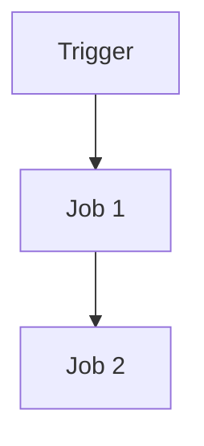
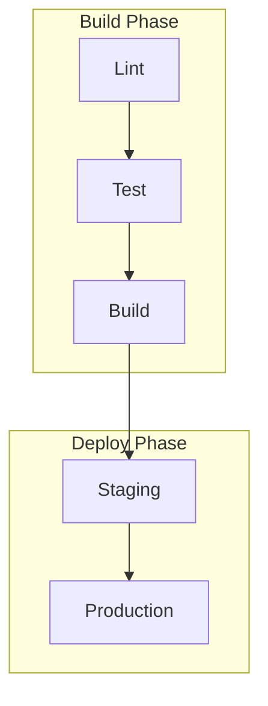

# Create GitHub Actions Workflow Specification

Generate a comprehensive specification for a GitHub Actions workflow that documents **what** the workflow accomplishes, not how it's implemented. This makes the spec useful for maintenance, refactoring, and onboarding regardless of implementation changes.

## Workflow

1. **Analyze the workflow file** — read the YAML, understand triggers, jobs, dependencies, secrets, and outputs.
2. **Map the execution flow** — identify job dependencies, parallelism, conditional paths, and quality gates.
3. **Extract requirements** — document functional, security, and performance requirements from the implementation.
4. **Generate the specification** — write the spec using the template below.
5. **Draw the Mermaid diagram** — visualize job dependencies and parallel paths.

## Analysis checklist

Before writing the spec, make sure you've identified:

- All trigger events (push, PR, schedule, workflow_dispatch, etc.)
- Job dependency graph (needs, if conditions)
- Secrets and environment variables required
- External service integrations (registries, cloud providers, notification services)
- Quality gates (required checks, approval steps)
- Error handling and retry strategies
- Artifacts produced and consumed

## Output

Save as: `/spec/spec-process-cicd-[workflow-name].md`

Use concise language, tables for dense data, and a Mermaid diagram for the execution flow. The spec should be readable by both humans and AI agents.

## Specification template

````md
---
title: CI/CD Workflow Specification - [Workflow Name]
version: 1.0
date_created: [YYYY-MM-DD]
last_updated: [YYYY-MM-DD]
status: Active
tags: [process, cicd, github-actions]
---

## Overview

**Purpose**: [One sentence]
**Trigger events**: [List]
**Target environments**: [List]

## Execution flow



## Jobs & dependencies

| Job    | Purpose             | Depends on | Runner        | Condition     |
| ------ | ------------------- | ---------- | ------------- | ------------- |
| build  | Compile and package | —          | ubuntu-latest | always        |
| test   | Run test suite      | build      | ubuntu-latest | always        |
| deploy | Deploy to prod      | test       | ubuntu-latest | branch = main |

## Requirements

### Functional

| ID      | Requirement   | Acceptance criteria |
| ------- | ------------- | ------------------- |
| REQ-001 | [Requirement] | [Testable criteria] |

### Security

| ID      | Requirement   | Constraint   |
| ------- | ------------- | ------------ |
| SEC-001 | [Requirement] | [Constraint] |

## Inputs & outputs

### Secrets & variables

| Type   | Name         | Purpose       | Scope    |
| ------ | ------------ | ------------- | -------- |
| Secret | DEPLOY_TOKEN | Deploy access | Workflow |

### Artifacts

| Name         | Produced by | Consumed by | Description          |
| ------------ | ----------- | ----------- | -------------------- |
| build-output | build       | deploy      | Compiled application |

## Constraints

- **Timeout**: [Max execution time]
- **Concurrency**: [Limits]
- **Runner requirements**: [OS, hardware]
- **Permissions**: [Required GitHub token scopes]

## Error handling

| Error type     | Response      | Recovery            |
| -------------- | ------------- | ------------------- |
| Build failure  | Fail workflow | Fix and re-push     |
| Deploy failure | Rollback      | Manual intervention |

## Quality gates

| Gate     | Criteria | Can bypass?   |
| -------- | -------- | ------------- |
| Tests    | All pass | No            |
| Coverage | ≥ 80%    | With approval |

## Integration points

| System   | Type                   | Data exchange |
| -------- | ---------------------- | ------------- |
| [System] | [webhook/API/artifact] | [Format]      |
````

- **PERF-001**: [Benchmark criteria]
- **PERF-002**: [Benchmark criteria]

## Change Management

### Update Process

1. **Specification Update**: Modify this document first
2. **Review & Approval**: [Approval process]
3. **Implementation**: Apply changes to workflow
4. **Testing**: [Validation approach]
5. **Deployment**: [Release process]

### Version History

| Version | Date   | Changes               | Author   |
| ------- | ------ | --------------------- | -------- |
| 1.0     | [Date] | Initial specification | [Author] |

## Related Specifications

- [Link to related workflow specs]
- [Link to infrastructure specs]
- [Link to deployment specs]

````markdown
## Analysis Instructions

When analyzing the workflow file:

1. **Extract Core Purpose**: Identify the primary business objective
2. **Map Job Flow**: Create dependency graph showing execution order
3. **Identify Contracts**: Document inputs, outputs, and interfaces
4. **Capture Constraints**: Extract timeouts, permissions, and limits
5. **Define Quality Gates**: Identify validation and approval points
6. **Document Error Paths**: Map failure scenarios and recovery
7. **Abstract Implementation**: Focus on behavior, not syntax

## Mermaid Diagram Guidelines

### Flow Types

- **Sequential**: `A --> B --> C`
- **Parallel**: `A --> B & A --> C; B --> D & C --> D`
- **Conditional**: `A --> B{Decision}; B -->|Yes| C; B -->|No| D`

### Styling

```mermaid
style TriggerNode fill:#e1f5fe
style SuccessNode fill:#e8f5e8
style FailureNode fill:#ffebee
style ProcessNode fill:#f3e5f5
```
````

### Complex Workflows

For workflows with 5+ jobs, use subgraphs:



## Token Optimization Strategies

1. **Use Tables**: Dense information in structured format
2. **Abbreviate Consistently**: Define once, use throughout
3. **Bullet Points**: Avoid prose paragraphs
4. **Code Blocks**: Structured data over narrative
5. **Cross-Reference**: Link instead of repeat information

Focus on creating a specification that serves as both documentation and a template for workflow updates.
